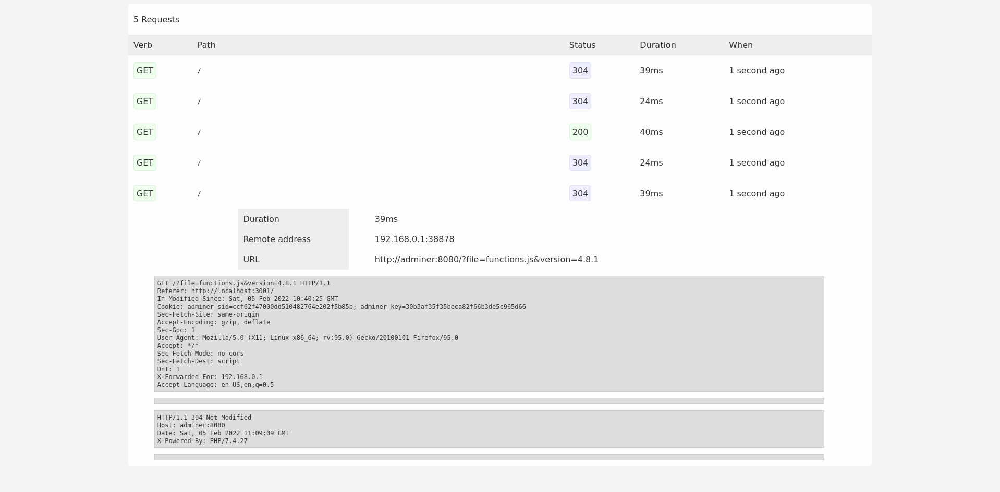

# HTTP Telescope

Debug HTTP requests using a reverse proxy.



## Description

This is a simple single-host reverse proxy that intercept and save HTTP
requests and responses (including plaintext bodies) in memory.
It has a minimal web dashboard.

## How to build

Clone the repo and issue `go build ./cmd/http-telescope` or use the docker
image `enrico204/http-telescope:latest`.

## Usage

```
Usage: http-telescope [options] [arguments]

OPTIONS
  --config-path/$CFG_CONFIG_PATH                    <string>    (default: /conf/config.yml)
  --web-listen/$CFG_WEB_LISTEN                      <string>    (default: 0.0.0.0:3001)
  --web-ui/$CFG_WEB_UI                              <string>    (default: 0.0.0.0:3002)
  --web-read-timeout/$CFG_WEB_READ_TIMEOUT          <duration>  (default: 5s)
  --web-write-timeout/$CFG_WEB_WRITE_TIMEOUT        <duration>  (default: 5s)
  --web-shutdown-timeout/$CFG_WEB_SHUTDOWN_TIMEOUT  <duration>  (default: 5s)
  --web-upstream/$CFG_WEB_UPSTREAM                  <string>    
  --log-level/$CFG_LOG_LEVEL                        <string>    (default: warn)
  --log-method-name/$CFG_LOG_METHOD_NAME            <bool>      (default: false)
  --log-json/$CFG_LOG_JSON                          <bool>      (default: false)
  --log-destination/$CFG_LOG_DESTINATION            <string>    (default: stderr)
  --log-file/$CFG_LOG_FILE                          <string>    (default: /tmp/debug.log)
  --disable-caching/$CFG_DISABLE_CACHING            <bool>      (default: false)
  --store-body/$CFG_STORE_BODY                      <bool>      (default: false)
  --help/-h                                         
  display this help message
```

* `--web-listen/$CFG_WEB_LISTEN` is the listen address for the reverse proxy
* `--web-ui/$CFG_WEB_UI` is the listen address for the web UI
* `--web-upstream/$CFG_WEB_UPSTREAM` is the web upstream
* `--store-body/$CFG_STORE_BODY` flag controls whether `http-telescope` need
  to capture the body or not. Note that the body is stored only if all of these
  are true:
  * it's plaintext (e.g., `text/*`, JSON/XML or URL-form encoded mime types)
  * `Content-Length` header is available (notably, in HTTP/2 is optional)
  * content length is less than 10KiB

### Example usage

```shell
http-telescope --web-upstream http://www.myserver.com
```

## License

This project is licensed under the MIT license. See LICENSE file.
